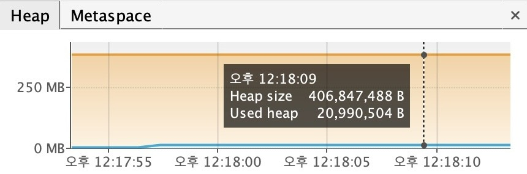
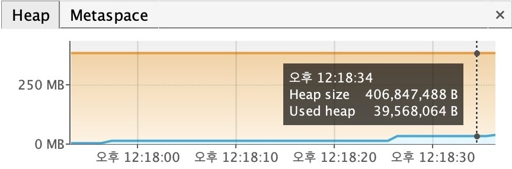

# Mission 1 - Wrapper 오버헤드 메모리 벤치마크 결과

## 측정 환경
- 배열 크기: 100만 개 (1,000,000)
- 측정 도구: VisualVM (시각적 힙 모니터링) + Runtime.getRuntime() (콘솔 수치 출력)

## 콘솔 측정 결과

```
=== 벤치마킹 시작 ===
VisualVM에서 이 프로세스를 연결한 후 엔터를 누르세요.

[초기값] Used Heap: 12.00 MB
[1단계] double[] 생성 중...
[double[]] Used Heap: 20.00 MB  |  순수 사용량: 8.00 MB
double[] 생성 완료 - VisualVM에서 힙 수치를 확인한 후 엔터를 누르세요.

[2단계] Double[] 생성 중...
[Double[]] Used Heap: 40.41 MB  |  순수 사용량: 20.41 MB
Double[] 생성 완료 - VisualVM에서 힙 수치를 확인한 후 엔터를 누르세요.


=== 최종 비교 ===
double[] 순수 사용량: 8.00 MB
Double[] 순수 사용량: 20.41 MB
메모리 배율: 2.6배
```

## VisualVM 힙 그래프

### double[] (primitive)
- Used heap: 20,990,504 B ≈ 20 MB



### Double[] (Wrapper 객체)
- Used heap: 39,568,064 B ≈ 37.7 MB



## 분석

| 구분 | 이론값 | 실측값 |
|------|--------|--------|
| `double[]` | 8 MB (8byte × 100만) | 8.00 MB ✅ |
| `Double[]` | 24 MB (24byte × 100만) | 20.41 MB ✅ |
| 메모리 배율 | 3배 | 2.6배 |

> 실측값이 이론값보다 낮은 이유: JVM GC가 Double[] 생성 루프 도중 자동 실행되어
> 일부 객체를 정리했기 때문에 측정 시점에 따라 수치가 달라질 수 있다.

## 결론

AI 임베딩처럼 실수형 데이터 수백만 개를 다룰 때 `Double[]`(Wrapper 객체)을 사용하면
`double[]`(primitive) 대비 **약 2.6배 더 많은 메모리**를 사용한다.

대규모 AI 데이터 처리 시 primitive 배열을 사용하는 것이 메모리 효율 면에서 유리하다.
